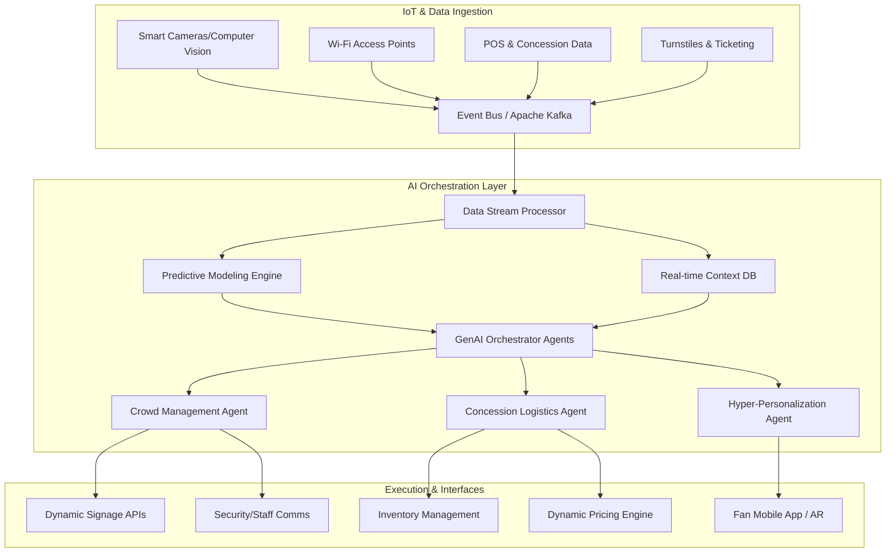

# Seamless Journey: AI-Powered Stadium Orchestration

## Executive Summary
The "Seamless Journey" Orchestration System transforms 60,000+ capacity sporting venues from static concrete containers into responsive, frictionless environments. By integrating real-time IoT data streams with advanced Generative AI and predictive modeling, the system dynamically synchronizes crowd movement, automates concession logistics, and delivers hyper-personalized navigation to every attendee.

---

## 1. Core Architecture

The architecture relies on a highly scalable, event-driven microservices model, processing thousands of events per second to feed our AI decision engines.

### Architecture Diagram

---

## 2. Key Modules & Workflows

### 2.1. Synchronized Crowd Movement
**Problem:** Dangerous bottlenecks and 'dead time' in queues.
**Solution:** The Crowd Management Agent processes real-time density data and predictive flow models to preemptively eliminate bottlenecks.

*   **Dynamic Signage Control:** The system automatically rewrites digital signage using GenAI to direct traffic organically (e.g., "Shorter lines for Section 112 via West Concourse").
*   **Predictive Dispatch:** GenAI agent alerts staff in natural language to open specific overflow gates or deploy temporary barriers 10 minutes *before* a critical mass forms.

> [!TIP]
> **Optimization Strategy**
> Use computer vision to gauge queue velocity, not just queue length, allowing the AI to predict exact wait times with high accuracy.

### 2.2. Automated Concession Logistics
**Problem:** Missed game moments due to long concession lines and stock-outs.
**Solution:** The system synchronizes food and beverage availability with game states and crowd location.

*   **Demand Prediction:** Analyzes game state (e.g., half-time approaching, home team scored) and crowd sentiment to predict demand spikes for specific items at specific stands.
*   **Generative Load Balancing:** If Stand A is overwhelmed, the GenAI engine automatically generates a targeted, time-limited promotion in the Fan App: *"Hey John, skip the line! Grab a hotdog at Stand B (2 mins away) for 20% off if you order in the next 5 mins."*

### 2.3. Hyper-Personalized Navigation
**Problem:** Fans feel lost, leading to poor experiences and inefficient movement.
**Solution:** A responsive, context-aware routing engine integrated into the Fan App.

*   **Contextual Routing:** Instead of the shortest physical distance, the app routes fans via the "lowest friction" path, factoring in real-time congestion, their specific ticket constraints, and even accessibility needs.
*   **"Game Moment" Protection:** If a fan is returning to their seat and the AI predicts they will miss an impending key play (based on player tracking data and game momentum), it pushes an alert guiding them to the nearest viewing portal or concourse screen.

---

## 3. The Generative AI Advantage

While traditional ML handles the predictive modeling (e.g., "Queue at Gate C will be 20 mins"), **Generative AI** handles the *orchestration and human interface*:

| Component | Traditional Approach | GenAI Approach |
| :--- | :--- | :--- |
| **Staff Alerts** | Red light on a dashboard | "Security: Send 3 guards to Sector 4. A minor bottleneck is forming near the restrooms." |
| **Fan Comms** | "Stand full" | "Looks busy here! Your favorite craft beer has zero wait time at Section 120." |
| **Edge Cases** | Fails silently or crashes | Agents reason through unexpected events (e.g., sudden weather change) to generate new evacuation/routing protocols dynamically. |

---

## 4. Implementation Roadmap

1.  **Phase 1: Foundation (Months 1-3)**
    *   Deploy IoT ingestion pipelines (Kafka).
    *   Integrate existing venue data silos (POS, Ticketing).
2.  **Phase 2: Predictive & Reactive (Months 4-6)**
    *   Train ML models for crowd density and wait-time prediction.
    *   Implement baseline Fan App routing.
3.  **Phase 3: GenAI Orchestration (Months 7-9)**
    *   Deploy LLM-powered Agents for Staff communications and dynamic fan messaging.
    *   Integrate dynamic signage control.
4.  **Phase 4: Frictionless Optimization (Months 10-12)**
    *   Implement Generative Load Balancing for concessions.
    *   Full system auto-scaling and tuning.

> [!WARNING]
> **Privacy First**
> The system must operate primarily on anonymized, aggregated telemetry data. Hyper-personalization is strict "opt-in" via the Fan App, with data zeroing post-event to maintain trust and compliance.
